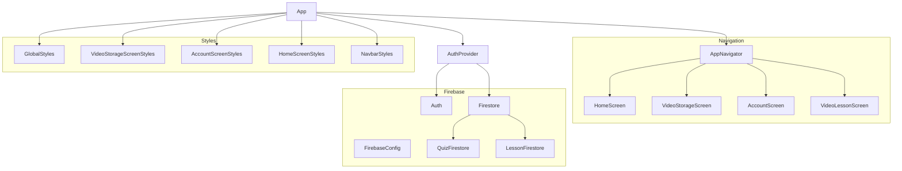

    

    <b>Automatic Architecture Diagrams from Code</b> 
    <a href="https://github.com/JashanMaan28/swark-continued">GitHub (Fork)</a> • <a href="https://github.com/swark-io/swark">Original Project</a>

## Usage Instructions

1. **Render the Diagram**: Use the links below to open it in Mermaid Live Editor, or install the [Mermaid Support](https://marketplace.visualstudio.com/items?itemName=bierner.markdown-mermaid) extension.
2. **Recommended Model**: If available for you, use `gemini` [language model](vscode://settings/swark-continued.languageModel). It can process more files and generates better diagrams.
3. **Iterate for Best Results**: Language models are non-deterministic. Generate the diagram multiple times and choose the best result.

## Generated Content
**Model**: GPT-4o mini - [Change Model](vscode://settings/swark-continued.languageModel)  
**Mermaid Live Editor**: [View](https://mermaid.live/view#pako:eNp1ksuOgjAUhl-FdK0vwGISlPEuapjMpnVR4AhNoCW9mDjGd59KNVbRLpr85_s5N3pGuSgAhYjwUtK2Cn5iwgN7Ihy17T4YDr-CEY6MrrZSHFkBcn_jHRpfXQk9spJqcUfuViZzGW-YCe7A9Yy7r2M8Ew2kuQTg-1f4jX9tOZHavLT8ZJrgKM-F4foDn7okK1BK8CcP8ILwl04nTEJGFTyyzPA9Nhb8wEqvwLzbihdYdF5l-wUvusQ7w_7ekRV2bb0yr7NRN8TcFwsnFp1Y-mLVmyfVpxrUo-IaT2uR0drFvVaSN7vumTbPu-7xrfc3e3CH7TPIqHwC3qTuOa19kfhi44utL3aEowFqQDaUFfYhnwnSFTRAUBgQVMCBmloTdLEm0xZUQ8yoXU-DQi0NDBA1WqQnnt-1FKasUHigtYLLP4ix7uQ) | [Edit](https://mermaid.live/edit#pako:eNp1ksuOgjAUhl-FdK0vwGISlPEuapjMpnVR4AhNoCW9mDjGd59KNVbRLpr85_s5N3pGuSgAhYjwUtK2Cn5iwgN7Ihy17T4YDr-CEY6MrrZSHFkBcn_jHRpfXQk9spJqcUfuViZzGW-YCe7A9Yy7r2M8Ew2kuQTg-1f4jX9tOZHavLT8ZJrgKM-F4foDn7okK1BK8CcP8ILwl04nTEJGFTyyzPA9Nhb8wEqvwLzbihdYdF5l-wUvusQ7w_7ekRV2bb0yr7NRN8TcFwsnFp1Y-mLVmyfVpxrUo-IaT2uR0drFvVaSN7vumTbPu-7xrfc3e3CH7TPIqHwC3qTuOa19kfhi44utL3aEowFqQDaUFfYhnwnSFTRAUBgQVMCBmloTdLEm0xZUQ8yoXU-DQi0NDBA1WqQnnt-1FKasUHigtYLLP4ix7uQ)

