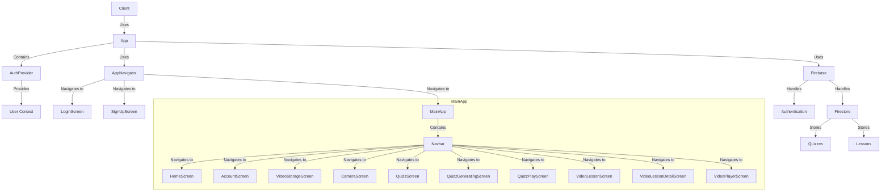

    

    <b>Automatic Architecture Diagrams from Code</b> 
    <a href="https://github.com/JashanMaan28/swark-continued">GitHub (Fork)</a> • <a href="https://github.com/swark-io/swark">Original Project</a>

## Usage Instructions

1. **Render the Diagram**: Use the links below to open it in Mermaid Live Editor, or install the [Mermaid Support](https://marketplace.visualstudio.com/items?itemName=bierner.markdown-mermaid) extension.
2. **Recommended Model**: If available for you, use `gemini` [language model](vscode://settings/swark-continued.languageModel). It can process more files and generates better diagrams.
3. **Iterate for Best Results**: Language models are non-deterministic. Generate the diagram multiple times and choose the best result.

## Generated Content
**Model**: GPT-4o mini - [Change Model](vscode://settings/swark-continued.languageModel)  
**Mermaid Live Editor**: [View](https://mermaid.live/view#pako:eNqNk9tOwzAMhl-lyjW8wC6QRgcbMMZGt4GU7iJrTRepdaocJg7j3XGaTjAY0FxUqv_vt2MneWOZyoH1WIqFFvUmmg9SjGj1eVxKQLuKTk_PdgsDZhed835dr4J-3sRjhVZIJC3mfWc3U622MgfdQnEDtUGCBpwS6ci74NkeZAoVLnyFidjKQli1z3LRAG0UTGTVLrrkY1VITDINgH9wQ57IAhf1v-CI31Ijn_2Fr3HrMJZWDFG_Rt_6v-KUby32e_br6kiZaz5SFRzs5jf0hvezTDm0negxX9KMVUJjE0W3Arc8FhVo0Qme8JmTr6-d2LvADgEpu5VYdHJNg2taipdO_Cx0PAZjFHZy3H91DIBOruzkS4LP7wz0gQMwT_HnNZ7zS6lhLQy03LwRRwLz0uuL5rHQ65IZzUfhcWrZZDF0ovs0ywbwZ-z1hzAwMEfVRx769Co7YXTQlZA5vfS3lFHtClLWi1KWw5NwpU3ZO0GuzqnpgRR06SvWs9rBCRPOquQFs_2_Vq7YsN6TKA28fwB_gGQ1) | [Edit](https://mermaid.live/edit#pako:eNqNk9tOwzAMhl-lyjW8wC6QRgcbMMZGt4GU7iJrTRepdaocJg7j3XGaTjAY0FxUqv_vt2MneWOZyoH1WIqFFvUmmg9SjGj1eVxKQLuKTk_PdgsDZhed835dr4J-3sRjhVZIJC3mfWc3U622MgfdQnEDtUGCBpwS6ci74NkeZAoVLnyFidjKQli1z3LRAG0UTGTVLrrkY1VITDINgH9wQ57IAhf1v-CI31Ijn_2Fr3HrMJZWDFG_Rt_6v-KUby32e_br6kiZaz5SFRzs5jf0hvezTDm0negxX9KMVUJjE0W3Arc8FhVo0Qme8JmTr6-d2LvADgEpu5VYdHJNg2taipdO_Cx0PAZjFHZy3H91DIBOruzkS4LP7wz0gQMwT_HnNZ7zS6lhLQy03LwRRwLz0uuL5rHQ65IZzUfhcWrZZDF0ovs0ywbwZ-z1hzAwMEfVRx769Co7YXTQlZA5vfS3lFHtClLWi1KWw5NwpU3ZO0GuzqnpgRR06SvWs9rBCRPOquQFs_2_Vq7YsN6TKA28fwB_gGQ1)

