    

    <b>Automatic Architecture Diagrams from Code</b> 
    <a href="https://github.com/JashanMaan28/swark-continued">GitHub (Fork)</a> • <a href="https://github.com/swark-io/swark">Original Project</a>

## Usage Instructions

1. **Render the Diagram**: Use the links below to open it in Mermaid Live Editor, or install the [Mermaid Support](https://marketplace.visualstudio.com/items?itemName=bierner.markdown-mermaid) extension.
2. **Recommended Model**: If available for you, use `gemini` [language model](vscode://settings/swark-continued.languageModel). It can process more files and generates better diagrams.
3. **Iterate for Best Results**: Language models are non-deterministic. Generate the diagram multiple times and choose the best result.

## Generated Content
**Model**: Auto - [Change Model](vscode://settings/swark-continued.languageModel)  
**Mermaid Live Editor**: [View](https://mermaid.live/view#pako:eNqVWM1uHEUQfpXWoEhBibGFsGStUKTN2g4rGWuTXXxhUdQ727PbYqZ7mB_LTpQD9wgiQBFwyQUEFw7cEAceJi9AHoHq36mZ6VljR4qmqr7qrqquP_t5FMs1i0bRUmwKmm_J4uFSEPgp65VhTFLORPX5Mnr35vs_LUXuPmE0rsg5rfglIydXuXx_GX1hNFva47raat0fXulvUOYxaEnRwqufM7nhYh4XjAnQ0BQxZA865xtR5x5ryCGwunYiRcWulBeKIpYks0Je8jUrejqnvGArWjJrviP1WS0wE-uGCPh_Ti_5Rvuro_DbH4jTtzTPrVQWytQ8J57ugUGyogr2UFaVzMiCrgbQN9lo4laaJ_7bkb0LP5EZ8yFXxFDAJzRjBfVQQw6BLyD-8oyVpWzeXvOIYZIzXla7tI5ZRXna1TLcsN4spdes6NxmmD2FxzV_9sxDFRU2SOMeMQGemsfTUM8I482dDhyw4KaXc3kJR7z98et___rWc8gUMhxAwTxzICiDhG9wfhtOsITmrLjkMXMlZMl-Fev4qwNL8FvB7Yt4VjAWWEFHIwy_KSATmeVSQJMx2fzN7-SzKWKGKm5h-wIUm_ocgkxFXmMc0Ywe-lNabe2J6tNAn4DZrGBDNfxUGQgKhgr76z863Vk9g06hd29e_6oSwDDI3VNaVuPZlMyuq60UQ915NjXN-aX6JCdinUseipNNZKaeBjT2ac73N5a39xUwexpTsYH3cyc6Ha65g8frUuydr1q0DJeycUDDNSrQtRhNof9vWfylQ24165Z5pTPz7c8_qRgryhVAGUgBwbMTAeOL6SwAihjy41Wx_2Aeg1_DKTGu11x6bU1h7cWWcrJYzMPh8HqmpyE9SLEVfJPxvYt-v4YN4IKmfG1bl6KJZ2j1WcH28kLGqpRv16LGJsN-eQ1fO5vSI5Zxwc2Dmm_y4QeH5DSl5bYHhsGd5ZV315BQbFmeQsaUtxt_4CTdMG3md_84crhpun2oaZqao-OkWuO94U43SSU8qKDFdXNpw3NX65PMC06OzwN7UkzTRl-T2nUwMR3yfah_nFxVrBA01d6_fOXpcHo7l582w8CxbnLfPGnztvDQLXkThnZMuhE4WW8Y5D-A1JcqhaYuLiSeSB2X79xxy2sshWCxSsLSiNDmSfb2HuCN0QDwvhlGIIYG4AXSIDCnBXHBxMbiTVCD7WwQzdTQ7GYn64nwFtYT9rauHgItPtgwfKrGtVq3wfQO715plzMR3OQaMN7TDBgZ1RjZLFmiv4m1bFSiHQfZBWyXt53tZpe_QWjo3hCkbX8AZf5324Z58GbNEWhxCcp8Sdh1oVcSOGQ2hrY9D8h7rQ1f1F4GQucFELjH48NaGWe9QwNsCITG8hAEzd4hCBqzg9bsigSyIhSGrrgfA2SjRth-iDIRCfGoaOU1DtjOYLsta5dnLUx7THayzU8X3iwCPuFsIFBYrLHdWzu2_I-4tI26sfuW1XXqxjpJeJqO3mNHyUfJERbbyjHi5AAALbF31QKOFAQD9BywwiQ5SA6xsPkjgb8AQC2I_TW9OYImB1ju1xN_AE2SlgEQays7hH8tmd5w_cmH7ZvH08FL3Qsho0Ee3Y-gj2aUr6NR9HwZVVuWwZwekWW0ZgmtU_iN4AWA6hwSkh1zCqmRRaOqqNn9iNaVnF-L2NGFrDfbaJTQtGQv_gPM1fcs) | [Edit](https://mermaid.live/edit#pako:eNqVWM1uHEUQfpXWoEhBibGFsGStUKTN2g4rGWuTXXxhUdQ727PbYqZ7mB_LTpQD9wgiQBFwyQUEFw7cEAceJi9AHoHq36mZ6VljR4qmqr7qrqquP_t5FMs1i0bRUmwKmm_J4uFSEPgp65VhTFLORPX5Mnr35vs_LUXuPmE0rsg5rfglIydXuXx_GX1hNFva47raat0fXulvUOYxaEnRwqufM7nhYh4XjAnQ0BQxZA865xtR5x5ryCGwunYiRcWulBeKIpYks0Je8jUrejqnvGArWjJrviP1WS0wE-uGCPh_Ti_5Rvuro_DbH4jTtzTPrVQWytQ8J57ugUGyogr2UFaVzMiCrgbQN9lo4laaJ_7bkb0LP5EZ8yFXxFDAJzRjBfVQQw6BLyD-8oyVpWzeXvOIYZIzXla7tI5ZRXna1TLcsN4spdes6NxmmD2FxzV_9sxDFRU2SOMeMQGemsfTUM8I482dDhyw4KaXc3kJR7z98et___rWc8gUMhxAwTxzICiDhG9wfhtOsITmrLjkMXMlZMl-Fev4qwNL8FvB7Yt4VjAWWEFHIwy_KSATmeVSQJMx2fzN7-SzKWKGKm5h-wIUm_ocgkxFXmMc0Ywe-lNabe2J6tNAn4DZrGBDNfxUGQgKhgr76z863Vk9g06hd29e_6oSwDDI3VNaVuPZlMyuq60UQ915NjXN-aX6JCdinUseipNNZKaeBjT2ac73N5a39xUwexpTsYH3cyc6Ha65g8frUuydr1q0DJeycUDDNSrQtRhNof9vWfylQ24165Z5pTPz7c8_qRgryhVAGUgBwbMTAeOL6SwAihjy41Wx_2Aeg1_DKTGu11x6bU1h7cWWcrJYzMPh8HqmpyE9SLEVfJPxvYt-v4YN4IKmfG1bl6KJZ2j1WcH28kLGqpRv16LGJsN-eQ1fO5vSI5Zxwc2Dmm_y4QeH5DSl5bYHhsGd5ZV315BQbFmeQsaUtxt_4CTdMG3md_84crhpun2oaZqao-OkWuO94U43SSU8qKDFdXNpw3NX65PMC06OzwN7UkzTRl-T2nUwMR3yfah_nFxVrBA01d6_fOXpcHo7l582w8CxbnLfPGnztvDQLXkThnZMuhE4WW8Y5D-A1JcqhaYuLiSeSB2X79xxy2sshWCxSsLSiNDmSfb2HuCN0QDwvhlGIIYG4AXSIDCnBXHBxMbiTVCD7WwQzdTQ7GYn64nwFtYT9rauHgItPtgwfKrGtVq3wfQO715plzMR3OQaMN7TDBgZ1RjZLFmiv4m1bFSiHQfZBWyXt53tZpe_QWjo3hCkbX8AZf5324Z58GbNEWhxCcp8Sdh1oVcSOGQ2hrY9D8h7rQ1f1F4GQucFELjH48NaGWe9QwNsCITG8hAEzd4hCBqzg9bsigSyIhSGrrgfA2SjRth-iDIRCfGoaOU1DtjOYLsta5dnLUx7THayzU8X3iwCPuFsIFBYrLHdWzu2_I-4tI26sfuW1XXqxjpJeJqO3mNHyUfJERbbyjHi5AAALbF31QKOFAQD9BywwiQ5SA6xsPkjgb8AQC2I_TW9OYImB1ju1xN_AE2SlgEQays7hH8tmd5w_cmH7ZvH08FL3Qsho0Ee3Y-gj2aUr6NR9HwZVVuWwZwekWW0ZgmtU_iN4AWA6hwSkh1zCqmRRaOqqNn9iNaVnF-L2NGFrDfbaJTQtGQv_gPM1fcs)

```mermaid
graph TB
    subgraph Client["📱 Client (React Native Expo)"]
        subgraph Auth["🔐 Authentication"]
            LoginScreen["Login Screen"]
            SignupScreen["Signup Screen"]
            AuthContext["Auth Context Provider"]
            FirebaseAuth["Firebase Auth"]
        end
        
        subgraph Navigation["🧭 Navigation"]
            AppNavigator["App Navigator"]
            Navbar["Bottom Tab Navigator"]
        end
        
        subgraph Screens["📺 Screens"]
            HomeScreen["Home Screen"]
            CameraScreen["Camera Screen"]
            VideoLessonScreen["Video Lesson List"]
            VideoLessonDetail["Video Lesson Detail"]
            VideoPlayerScreen["Video Player"]
            QuizzScreen["Quiz List"]
            QuizzGenerator["Quiz Generator"]
            QuizzPlayer["Quiz Player"]
        end
        
        subgraph Firebase["☁️ Firebase Integration"]
            FirebaseConfig["Firebase Config"]
            AuthService["Auth Service"]
            LessonFirestore["Lesson Firestore"]
            QuizFirestore["Quiz Firestore"]
        end
        
        subgraph Components["🎨 UI Components"]
            AppText["App Text"]
            AppTextInput["App Text Input"]
            MathText["Math Text Renderer"]
            Navbar_Comp["Navbar"]
        end
    end
    
    subgraph Server["🖥️ Server (FastAPI Python)"]
        subgraph API["🔌 API Endpoints"]
            GenerateQuiz["/api/generate-quiz"]
            IngestEndpoint["/api/ingest"]
            GenerateVideo["/api/generate-video"]
            VideoAPI["/api/videos"]
            HealthCheck["/api/health"]
        end
        
        subgraph Core["⚙️ Core Services"]
            ManimEngine["Manim Engine<br/>Scene Renderer"]
            AudioEngine["Audio Engine<br/>Thai TTS"]
            VideoEngine["Video Engine<br/>Combine A+V"]
            CodeValidator["Code Validator<br/>Pre-processor"]
        end
        
        subgraph AI["🤖 AI Integration"]
            GeminiAPI["Gemini 2.5 Flash"]
            PromptEngine["Prompt Templates"]
        end
        
        subgraph Storage["💾 Storage"]
            FirebaseClient["Firebase Client<br/>Auth+Firestore"]
            CloudinaryStorage["Cloudinary Storage<br/>Video CDN"]
            LocalStorage["Local Temp Files"]
        end
    end
    
    subgraph External["🌐 External Services"]
        Firebase_Service["Firebase<br/>Auth+Firestore"]
        Gemini["Gemini API"]
        Cloudinary["Cloudinary CDN"]
        EdgeTTS["Edge TTS<br/>Thai Voice"]
    end
    
    %% Client connections
    LoginScreen --> AuthContext
    SignupScreen --> AuthContext
    AuthContext --> FirebaseAuth
    FirebaseAuth --> Firebase_Service
    
    AppNavigator --> Navbar
    Navbar --> HomeScreen
    Navbar --> CameraScreen
    Navbar --> VideoLessonScreen
    Navbar --> QuizzScreen
    
    CameraScreen --> GenerateVideo
    VideoLessonScreen --> VideoLessonDetail
    VideoLessonDetail --> VideoPlayerScreen
    QuizzScreen --> QuizzGenerator
    QuizzGenerator --> GenerateQuiz
    QuizzScreen --> QuizzPlayer
    
    CameraScreen --> LessonFirestore
    VideoLessonScreen --> LessonFirestore
    QuizzScreen --> QuizFirestore
    QuizzGenerator --> QuizFirestore
    
    MathText --> Components
    AppText --> Components
    
    %% Server connections
    GenerateQuiz --> GeminiAPI
    GenerateQuiz --> CloudinaryStorage
    
    IngestEndpoint --> GeminiAPI
    IngestEndpoint --> PromptEngine
    
    GenerateVideo --> CodeValidator
    GenerateVideo --> ManimEngine
    GenerateVideo --> AudioEngine
    GenerateVideo --> VideoEngine
    GenerateVideo --> CloudinaryStorage
    
    ManimEngine --> GeminiAPI
    ManimEngine --> PromptEngine
    AudioEngine --> EdgeTTS
    VideoEngine --> LocalStorage
    
    CodeValidator --> PromptEngine
    
    VideoAPI --> CloudinaryStorage
    VideoAPI --> FirebaseClient
    
    %% External integrations
    GeminiAPI --> Gemini
    CloudinaryStorage --> Cloudinary
    AudioEngine --> EdgeTTS
    FirebaseClient --> Firebase_Service
    
    style Client fill:#e8f4f8
    style Server fill:#f0e8f8
    style External fill:#f8f0e8
    style Auth fill:#fff0f5
    style Navigation fill:#f0fff5
    style Screens fill:#fffaf0
    style Firebase fill:#f0faff
    style API fill:#f5f5ff
    style Core fill:#fff5f5
    style AI fill:#fffaf0
    style Storage fill:#f0fff0
```

